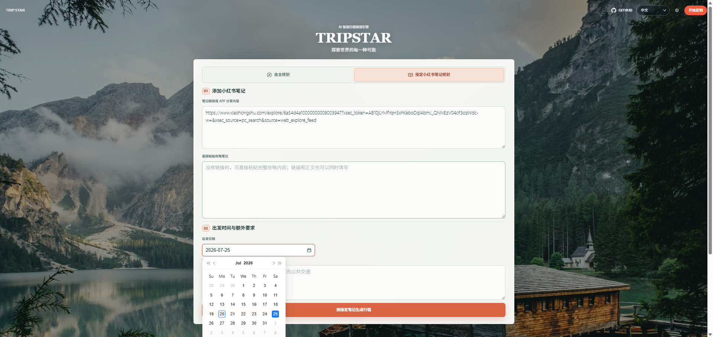
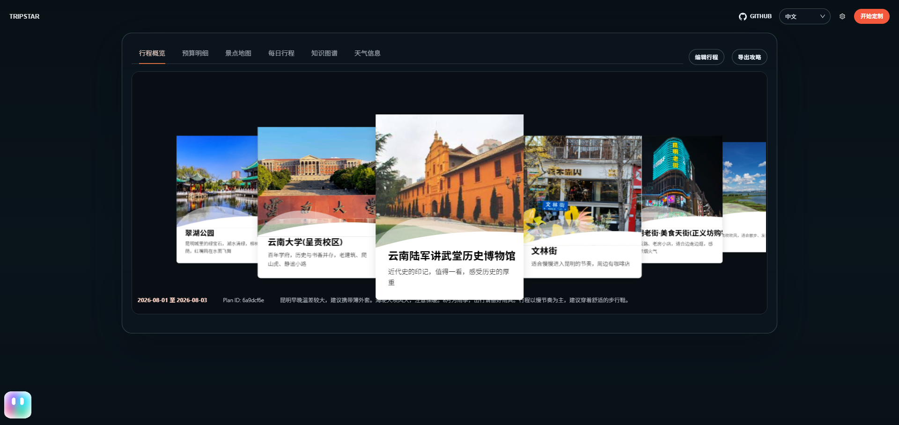
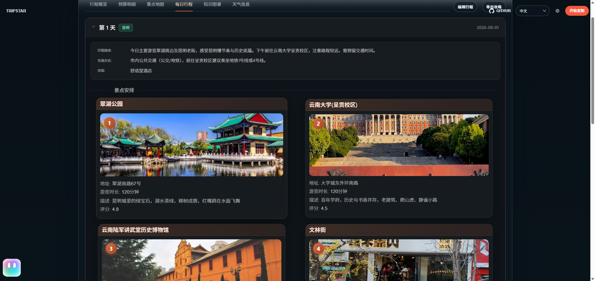
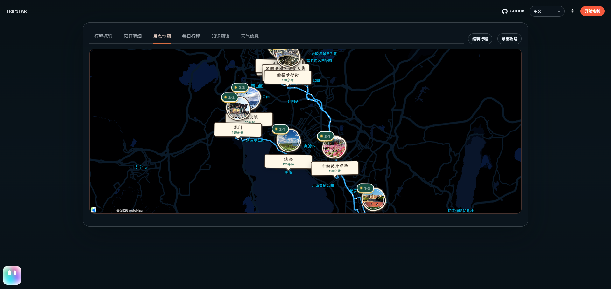
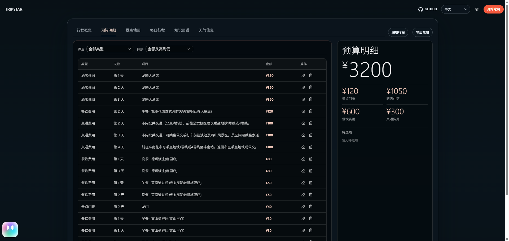
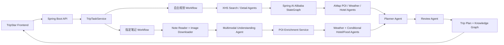
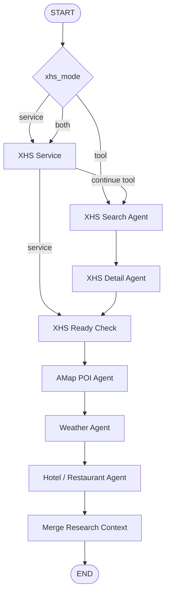

<div align="center">
  <h1>TripStar</h1>
  <p><strong>基于 Spring Boot 4 与 Spring AI Alibaba 的多智能体旅行规划系统</strong></p>
</div>

<p align="center">
  
  
  
  
  
</p>

TripStar 是一个前后端分离的 AI 旅行规划项目。系统使用多 Agent 协作理解用户需求，读取小红书旅行内容，查询高德 POI、天气、酒店与餐饮，并生成包含每日路线、地图、景点图片、预算和知识图谱的完整攻略。

- 后端 GitHub：[LeeFly-cn/TripStar-Java](https://github.com/LeeFly-cn/TripStar-Java)
- 后端 Gitee：[haigoya_admin/trip-star-java](https://gitee.com/haigoya_admin/trip-star-java)
- 前端 GitHub：[LeeFly-cn/TripStar-Frontend](https://github.com/LeeFly-cn/TripStar-Frontend)
- 社区：[LinuxDo](https://linux.do/)

## 项目预览

### 双模式规划入口

<p align="center">
  <a href="docs/images/planning-entry.png">
    
  </a>
</p>

<table>
  <tr>
    <td width="50%" align="center">
      <strong>行程概览</strong><br>
      <a href="docs/images/trip-overview.png">
        
      </a>
    </td>
    <td width="50%" align="center">
      <strong>每日行程</strong><br>
      <a href="docs/images/daily-itinerary.png">
        
      </a>
    </td>
  </tr>
  <tr>
    <td width="50%" align="center">
      <strong>景点地图与真实路线</strong><br>
      <a href="docs/images/route-map.png">
        
      </a>
    </td>
    <td width="50%" align="center">
      <strong>预算明细</strong><br>
      <a href="docs/images/budget-details.png">
        
      </a>
    </td>
  </tr>
</table>

## 核心能力

### 1. 自主规划

输入目的地、日期、交通方式、住宿偏好和自然语言要求，系统按以下顺序执行：

1. 小红书搜索 Agent 查找真实旅行笔记。
2. 小红书详情 Agent 读取正文并提炼景点、避坑和预约信息。
3. 高德 POI Agent 校准名称、地址和经纬度。
4. 天气 Agent 查询旅行天气。
5. 酒店餐饮 Agent 查询住宿与三餐候选。
6. Planner Agent 生成每日行程和预算。
7. Review Agent 检查结构与明显数据矛盾。

### 2. 指定笔记规划

用户可以输入一个或多个小红书长链接、短链、App 分享内容，或者直接粘贴攻略正文。系统会：

1. 解析公开笔记正文和全部图片。
2. 使用多模态模型识别图片中的 Day01、Day02、路线、酒店、餐厅和交通信息。
3. 按笔记原始顺序保留全部景点，不套用自主规划的每日数量限制。
4. 使用高德 Service 逐项补全 POI、地址、坐标、评分与图片。
5. 仅在笔记缺少酒店或餐饮时调用补充 Agent。
6. 使用独立 Planner 与 Review Prompt 生成并检查最终攻略。
7. Java 严格校验笔记景点是否全部进入最终行程，缺失时直接列出名称并终止任务。

### 3. 可观测的 Agent 工作流

- Spring AI Alibaba `StateGraph` 控制自主规划研究阶段的执行顺序和条件边。
- `ReactAgent` 负责阶段内的工具调用与参数决策。
- 每个 Agent 使用职责明确的小型 DTO，不共享包含大量无关字段的通用输出对象。
- Spring AI `BeanOutputConverter` 将模型 JSON 转换为 Java Record。
- 系统提示词、用户提示词、工具列表和模型原始输出写入 AI Trace 文件。
- WebSocket 实时推送当前阶段、进度和错误信息。

### 4. 真实数据链路

- 小红书支持 `service`、`tool`、`both` 三种运行模式。
- 高德提供地理编码、POI、天气、酒店、餐饮和图片数据。
- 餐饮与酒店查询使用高德类型过滤，避免景区或商场进入错误数据类别。
- 未配置密钥、Cookie 或工具调用失败时明确报错，不返回模拟数据。

## 系统架构



### 自主规划 StateGraph



## Agent 与输出契约

| 阶段 | Agent / Service | 结构化输出 |
| --- | --- | --- |
| 小红书搜索 | `XhsSearchAgent` | `XhsSearchResearchResult` |
| 小红书详情 | `XhsDetailAgent` | `XhsDetailResearchResult` |
| 高德研究 | POI / Weather / Hotel Agents | `MapAgentResult` |
| 指定笔记理解 | Multimodal Understanding Agent | `XhsNoteUnderstandingResult` |
| 最终规划 | `TripPlannerAgent` | `TripPlan` |
| 行程质检 | `TripReviewAgent` | `ReviewResult` |
| Graph 汇总 | Java Workflow | `TravelResearchResult` |

`TravelResearchResult` 只在 Graph 最终合并时创建，不作为单个阶段 Agent 的大而全输出 DTO。

## 技术栈

- Java 21
- Spring Boot 4.0.7
- Spring AI 2.0.0-M1
- Spring AI Alibaba 2.0.0-M1.1
- Spring AI Alibaba StateGraph / ReactAgent
- Spring AI Tool Calling / Structured Output / Multimodal Message
- Maven 多模块
- MyBatis-Plus、Sa-Token、Redis、MySQL
- 高德 Web Service API
- Node.js 小红书签名运行时

## 模块结构

```text
TripStar-Java/
├── app/                         # HTTP API、WebSocket、运行配置
├── common/
│   ├── core/                   # 异常、常量、运行时设置
│   ├── json/                   # JSON 配置
│   ├── redis/                  # Redis
│   ├── satoken/                # Sa-Token
│   └── web/                    # Web 通用配置
├── modules/
│   ├── ai/                     # Agent、Structured Output、Prompt、Trace
│   ├── content/                # 小红书搜索、详情、公开笔记与图片读取
│   ├── map/                    # 高德 API、Tool、POI 图片代理
│   └── trip/                   # Workflow、规划、质检、DTO、知识图谱
├── docs/                       # 源码学习与实现文档
├── .env.example
└── pom.xml
```

## 环境要求

- JDK 21
- Maven 3.9+
- Node.js 18+
- MySQL 8+
- Redis 6+
- DashScope API Key
- 高德 Web Service Key
- 自主规划使用小红书搜索时需要有效 Cookie

指定笔记模式读取公开笔记页面时不要求用户填写 Cookie；页面触发登录或风控验证时会明确失败。

## 配置

参考 `.env.example` 配置 IDE、Shell 或部署平台环境变量：

```bash
AI_DASHSCOPE_ENABLED=true
AI_DASHSCOPE_API_KEY=your_dashscope_key_here
AI_DASHSCOPE_CHAT_MODEL=qwen-plus
AI_TRACE_ENABLED=true
AI_TRACE_DIR=./logs/ai-trace

AMAP_ENABLED=true
AMAP_KEY=your_amap_web_service_key_here

XHS_ENABLED=true
XHS_MODE=tool
XHS_COOKIE=your_xhs_cookie_here
XHS_SIGN_DIR=classpath:xhs_sign

DB_URL=jdbc:mysql://localhost:3306/tripstar?useUnicode=true&characterEncoding=utf8&serverTimezone=Asia/Shanghai
DB_USERNAME=root
DB_PASSWORD=

REDIS_HOST=localhost
REDIS_PORT=6379
REDIS_DATABASE=0
REDIS_PASSWORD=
```

`XHS_MODE` 可选值：

| 模式 | 说明 |
| --- | --- |
| `service` | Java Service 按固定流程采集内容 |
| `tool` | ReactAgent 调用小红书 Tool |
| `both` | 两条链路都执行并合并，用于效果对比 |

小红书签名资源已内置：

```text
modules/content/src/main/resources/xhs_sign/
```

## 启动

```bash
git clone https://github.com/LeeFly-cn/TripStar-Java.git
cd TripStar-Java
mvn -DskipTests package
java -jar app/target/app-0.0.1-SNAPSHOT.jar
```

Windows PowerShell：

```powershell
$env:JAVA_HOME="C:\path\to\jdk-21"
$env:Path="$env:JAVA_HOME\bin;$env:Path"
mvn -DskipTests package
java -jar app\target\app-0.0.1-SNAPSHOT.jar
```

默认地址：`http://localhost:8080`

## 启动前端

```bash
git clone https://github.com/LeeFly-cn/TripStar-Frontend.git
cd TripStar-Frontend
cp .env.example .env
npm install
npm run dev
```

前端默认地址：`http://localhost:5173`

## API

| 接口 | 方法 | 说明 |
| --- | --- | --- |
| `/health` | GET | 健康检查 |
| `/api/settings` | GET / PUT | 读取或更新运行时设置 |
| `/api/trip/plan` | POST | 提交自主规划任务 |
| `/api/trip/plan/xhs-notes` | POST | 提交指定笔记规划任务 |
| `/api/trip/status/{taskId}` | GET | 查询任务状态与结果 |
| `/api/trip/ws/{taskId}` | WebSocket | 订阅实时进度 |
| `/api/trip/history` | GET | 查询当前运行实例的任务历史 |
| `/api/poi/photo` | GET | 查询小红书景点图片 |
| `/api/poi/photo/amap` | GET | 查询高德 POI 图片 |
| `/api/poi/photo/amap/proxy` | GET | 代理高德图片用于展示与导出 |
| `/api/chat/ask` | POST | 基于当前行程继续问答 |

### 自主规划请求

```json
{
  "city": "昆明",
  "cities": [{ "city": "昆明", "days": 3 }],
  "start_date": "2026-08-01",
  "end_date": "2026-08-03",
  "travel_days": 3,
  "transportation": "公共交通",
  "accommodation": "交通方便的舒适型酒店",
  "preferences": ["自然风光", "本地美食"],
  "free_text_input": "带老人，不想太累，不去滇池",
  "language": "zh"
}
```

### 指定笔记请求

```json
{
  "share_text": "小红书分享内容、长链接或短链，可填写多个",
  "note_content": "也可以直接粘贴攻略正文",
  "requirement": "不去滇池，保留笔记中的全部景点",
  "start_date": "2026-08-01"
}
```

两个接口都会立即返回 `task_id`，后续通过状态接口或 WebSocket 获取进度和最终结果。

## AI Trace

```text
logs/ai-trace/yyyy-MM-dd/*.md
```

每个 Trace 文件包含：

- Agent 名称与 threadId
- 系统提示词
- 用户提示词
- 可用工具
- 模型原始输出
- 调用耗时与状态

排查 Agent 未调用工具、Structured Output 失败、Prompt 约束冲突或数据分类错误时，优先查看对应 taskId 的 Trace。

## 前端能力

独立前端仓库提供：

- 自主规划与指定笔记规划双入口
- WebSocket 真实阶段进度
- 每日行程、酒店、三餐、天气和预算
- 高德与 Google 地图切换
- 真实道路路线规划
- 景点图片卡片与 `1-1 / 1-2` 路线序号
- 知识图谱
- 攻略图片与 PDF 导出
- 中文、英文、日文界面
- 运行时模型、地图和小红书配置

## 学习文档

- [代码运行导读](docs/TRIPSTAR_CODE_WALKTHROUGH.md)
- [Agent 学习指南](docs/TRIPSTAR_AGENT_LEARNING_GUIDE.md)
- [指定笔记规划实现指南](docs/XHS_NOTE_PLANNING_IMPLEMENTATION_GUIDE.md)

推荐阅读顺序：

1. `TripController`
2. `TripTaskService`
3. `TripResearchService`
4. `XhsNoteResearchService`
5. `XhsNoteMapResearchService`
6. `TripAiPlannerService`
7. `AiAgentService`
8. `AiStructuredOutputService`
9. `AiPromptTraceService`

## 注意事项

- 小红书网页接口和签名规则可能变化，请遵守平台协议、法律法规和合理请求频率。
- 不要提交真实 Cookie、API Key、`.env`、`runtime_settings.json`、Trace 日志或临时图片。
- LLM 规划结果仅作为旅行建议，营业时间、票价、天气和交通信息请在出发前再次确认。

## License

本项目使用 [GPL-2.0](LICENSE) 协议开源。
