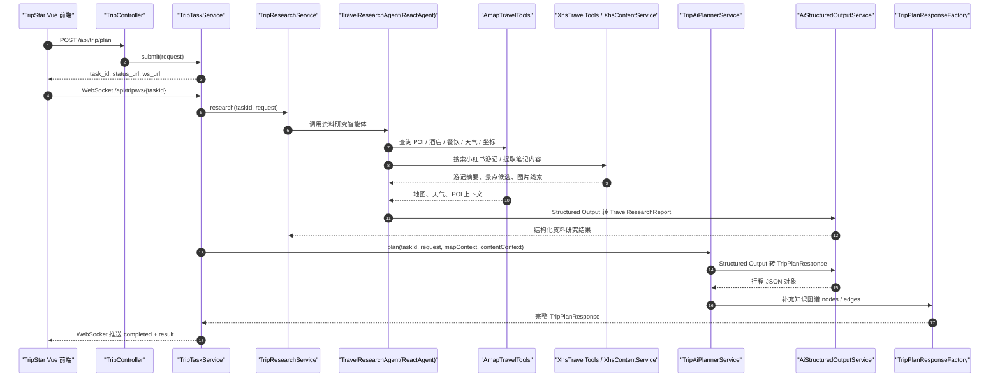

<div align="center">
  <h1>旅途星辰 Java 实现版 - TripStar Java</h1>
  <p><strong>基于 Spring Boot 4 + Spring AI Alibaba 重写 TripStar 后端的 AI 旅行规划项目</strong></p>
</div>

<p align="center">
  
  
  
  
  
</p>

> [!IMPORTANT]
>
> 本项目是 [1sdv/TripStar](https://github.com/1sdv/TripStar) 的 Java 后端学习实现版。产品形态、前端交互、旅行规划思路参考原 TripStar；后端使用 Java 21、Spring Boot 4、Spring AI Alibaba、ReactAgent、Structured Output 和 Spring AI Tool 重新实现。
>
> 前端可以继续使用原 TripStar 的 Vue 项目：下载原仓库的 `frontend` 目录，把接口地址指向本 Java 后端即可。

## 项目简介

**旅途星辰 Java 实现版 (TripStar Java)** 是一个面向学习和二次开发的 AI 旅行规划后端。它保留原 TripStar “输入城市、天数、偏好和备注，自动生成旅行攻略”的使用体验，并重点演示如何在 Java 技术栈里落地 Agent 应用。

这个版本的核心目标不是简单把 Python 代码逐行翻译成 Java，而是把 TripStar 的能力拆成更适合 Java 工程学习的模块：

- 用 `ReactAgent` 作为资料研究智能体，让大模型主动调用高德和小红书工具。
- 用 Spring AI `BeanOutputConverter` 做结构化输出，减少手写 JSON 修复逻辑。
- 用小红书真实游记内容辅助 LLM 提炼景点、避坑建议、预约提醒和用户口吻偏好。
- 用高德地图工具查询 POI、酒店、餐饮、天气和坐标信息。
- 保持与原 Vue 前端相近的接口和 WebSocket 进度推送体验。

适合的学习方向：

- Spring AI Alibaba / Spring AI Tool 调用
- ReactAgent 旅行推荐场景实践
- LLM 结构化输出和 DTO 落地
- 小红书内容采集、提炼和旅游推荐结合
- 高德地图 POI、天气、酒店、餐饮工具封装
- 前后端分离的长任务进度推送

## 与原 TripStar 的关系

原项目地址：[https://github.com/1sdv/TripStar](https://github.com/1sdv/TripStar)

原 TripStar 是一个基于 Python FastAPI、HelloAgents、多智能体和 Vue 前端的 AI 文旅规划平台。本仓库的定位是：

- **后端 Java 化**：使用 Spring Boot 4 多模块工程重写后端主流程。
- **Agent 学习化**：突出 Spring AI Alibaba `ReactAgent`、工具调用、结构化输出和 Prompt 管理。
- **前端兼容化**：尽量保留原 Vue 前端需要的 `/api/trip/plan`、`/api/trip/status/{taskId}`、`/api/trip/ws/{taskId}` 等接口形态。
- **数据真实化**：小红书和高德未配置时直接提示缺配置，不再用模拟数据假装成功。

如果你要运行完整前端效果，可以直接复用原项目的 Vue 前端：

```bash
git clone https://github.com/1sdv/TripStar.git
cd TripStar/frontend
npm install
npm run dev
```

然后把前端请求地址配置为 Java 后端地址，例如 `http://localhost:8080`。

## 核心亮点

- **Java 服务端改写**：后端基于 Java 21、Spring Boot 4 和 Maven 多模块组织，方便 Java 开发者学习和二开。
- **Spring AI Alibaba ReactAgent**：资料研究阶段由 Agent 自主调用高德 Tool 和小红书 Tool，更接近真实 Agentic Workflow。
- **小红书双形态接入**：支持 `service`、`tool`、`both` 三种模式，既能对标 Python 版确定性采集，也能学习 Agent 调工具。
- **高德工具化**：POI、酒店、餐饮、天气、坐标查询都封装为 Tool，交给资料研究智能体按用户需求调用。
- **Structured Output**：规划、研究、质检等 LLM 输出使用 Spring AI 结构化输出转 DTO，代码比手写 JSON 提取更易读。
- **Prompt 资源化管理**：较长提示词统一放在 `modules/ai/src/main/resources/prompts/tripstar/`，避免硬编码散落在业务代码里。
- **WebSocket 进度推送**：长耗时规划任务先返回 `task_id`，前端通过轮询或 WebSocket 获取进度。
- **知识图谱输出**：后端根据行程结果生成 `nodes` 和 `edges`，供 Vue 前端用 ECharts 展示城市、天数、景点、预算之间的关系。

## 示例场景

用户只需要输入类似下面的信息：

> 我带老人去昆明玩 3 天，不想太累，不想看滇池，住得方便一点，喜欢自然风光和本地美食。

Java 后端会按下面思路处理：

1. 读取用户城市、天数、偏好、住宿和自由备注。
2. 资料研究智能体调用小红书工具，搜索真实游记并提炼候选景点、避坑点和预约提醒。
3. 资料研究智能体调用高德工具，查询 POI、酒店、餐饮、天气和坐标。
4. 规划智能体合并用户约束和真实上下文，生成每日行程、预算、交通建议、住宿建议和备注。
5. 质检智能体检查是否违背用户要求，例如“不想看滇池”就不应把滇池安排进行程。
6. 后端补充知识图谱数据，前端展示路线、日程卡片、预算和图谱。

示例请求：

```json
{
  "city": "昆明",
  "cities": [
    {
      "city": "昆明",
      "days": 3
    }
  ],
  "travel_days": 3,
  "transportation": "公共交通",
  "accommodation": "住得方便一点",
  "preferences": ["自然风光", "美食", "轻松"],
  "free_text_input": "带老人，不想太累，不想看滇池",
  "language": "zh"
}
```

提交接口：

```bash
curl -X POST http://localhost:8080/api/trip/plan \
  -H "Content-Type: application/json" \
  -d '{"city":"昆明","travel_days":3,"transportation":"公共交通","accommodation":"住得方便一点","preferences":["自然风光","美食","轻松"],"free_text_input":"带老人，不想太累，不想看滇池","language":"zh"}'
```

返回示例：

```json
{
  "task_id": "192aa4c1",
  "status_url": "/api/trip/status/192aa4c1",
  "ws_url": "/api/trip/ws/192aa4c1"
}
```

查询进度：

```bash
curl http://localhost:8080/api/trip/status/192aa4c1
```

## 系统架构



## 模块结构

```text
backend_java/
├── app/
│   ├── src/main/java/com/zkry/api/trip/      # 行程接口、设置接口、WebSocket
│   └── src/main/resources/application.yml    # Spring Boot 与 TripStar 配置
├── common/
│   ├── core/                                 # 通用异常、运行时配置、工具类
│   ├── json/                                 # JSON 配置
│   ├── redis/                                # Redis 配置
│   ├── satoken/                              # Sa-Token 集成
│   └── web/                                  # Web 通用配置
├── modules/
│   ├── ai/                                   # ReactAgent、结构化输出、Prompt 加载
│   ├── content/                              # 小红书搜索、详情、签名、Tool
│   ├── map/                                  # 高德 REST 调用和 Tool
│   └── trip/                                 # 旅行规划主流程、DTO、知识图谱
├── docs/
│   ├── TRIPSTAR_CODE_WALKTHROUGH.md          # 代码运行链路学习文档
│   └── TRIPSTAR_AGENT_LEARNING_GUIDE.md      # 智能体学习文档
└── TRIPSTAR_JAVA_MIGRATION_PLAN.md           # Java 迁移计划
```

## 技术栈

- Java 21
- Spring Boot 4.0.7
- Spring AI 2.0.0-M1
- Spring AI Alibaba 2.0.0-M1.1
- Spring AI Structured Output
- Maven 多模块
- MyBatis-Plus
- Sa-Token
- Redis
- MySQL
- Vue 3.x 前端复用原 TripStar 项目

## 环境准备

后端运行需要：

- JDK 21
- Maven 3.9+
- Node.js 18+，用于执行小红书签名脚本
- MySQL，脚手架默认数据源
- Redis，脚手架默认缓存配置
- DashScope API Key，或你自行扩展兼容的 ChatModel
- 高德 Web 服务 Key
- 小红书 Cookie，网页端登录后从浏览器开发者工具复制

> 小红书接口和签名策略可能随平台变化而失效。本项目仅用于学习和个人研究，请遵守目标网站协议、法律法规和频率限制。

## 后端配置

复制环境变量模板：

```bash
cd backend_java
cp .env.example .env
```

`.env.example` 只是配置模板。Spring Boot 默认不会自动读取项目根目录的 `.env` 文件，实际运行时请把这些值导出为系统环境变量、配置到 IDE 启动环境，或使用 `--KEY=value` 形式追加到启动命令。

关键配置：

```bash
AI_DASHSCOPE_ENABLED=true
AI_DASHSCOPE_API_KEY=your_dashscope_key_here
AI_DASHSCOPE_CHAT_MODEL=qwen-plus

AMAP_ENABLED=true
AMAP_KEY=your_amap_web_service_key_here

XHS_ENABLED=true
XHS_MODE=tool
XHS_COOKIE=your_xhs_cookie_here
XHS_SIGN_DIR=classpath:xhs_sign

DB_URL=jdbc:mysql://localhost:3306/tripstar?useUnicode=true&characterEncoding=utf8&serverTimezone=Asia/Shanghai
DB_USERNAME=root
DB_PASSWORD=

REDIS_HOST=localhost
REDIS_PORT=6379
```

小红书模式说明：

```text
service  Java service 主动采集小红书，再把结果交给规划流程。
tool     ReactAgent 自己决定什么时候调用小红书 Tool。
both     service 和 tool 两条链路都执行并合并上下文，适合学习对比。
```

小红书签名资产已经内置在 Java content 模块：

```text
modules/content/src/main/resources/xhs_sign/
```

默认 `XHS_SIGN_DIR=classpath:xhs_sign`。程序第一次生成签名时会把这几个 JS 文件抽取到临时目录，再交给 Node.js 执行。你也可以把 `XHS_SIGN_DIR` 改成一个本地绝对路径，用于调试外部签名目录。

## 启动后端

Windows PowerShell 示例：

```powershell
cd D:\code\lifei\TripStar\backend_java
$env:JAVA_HOME="C:\Users\welco\.jdks\azul-21.0.11"
$env:Path="$env:JAVA_HOME\bin;$env:Path"
mvn -DskipTests package
java -jar app\target\app-0.0.1-SNAPSHOT.jar --spring.profiles.active=dev
```

通用命令：

```bash
cd backend_java
mvn -DskipTests package
java -jar app/target/app-0.0.1-SNAPSHOT.jar --spring.profiles.active=dev
```

健康检查：

```bash
curl http://localhost:8080/health
```

## 前端复用方式

本仓库重点是 Java 后端。如果你想使用完整页面，可以直接下载原 TripStar 的 Vue 前端：

```bash
git clone https://github.com/1sdv/TripStar.git
cd TripStar/frontend
npm install
```

在前端环境变量里把 API 地址改成 Java 后端：

```bash
VITE_API_BASE_URL=http://localhost:8080
```

如果前端仍保留高德 JS API 配置，也需要填写原前端要求的高德 Web 端 JS Key 和安全密钥。

```bash
npm run dev
```

## 主要接口

| 接口 | 方法 | 说明 |
| --- | --- | --- |
| `/health` | GET | 健康检查 |
| `/api/settings` | GET | 读取运行时配置快照 |
| `/api/settings` | PUT | 保存前端配置页提交的运行时配置 |
| `/api/trip/plan` | POST | 提交旅行规划任务 |
| `/api/trip/status/{taskId}` | GET | 查询任务进度和结果 |
| `/api/trip/ws/{taskId}` | WebSocket | 订阅任务进度 |
| `/api/poi/photo` | GET | 按景点名称查询图片线索 |
| `/api/chat/ask` | POST | 基于行程上下文的问答入口 |

## 学习代码推荐路线

建议按下面顺序阅读：

1. `app/src/main/java/com/zkry/api/trip/TripController.java`：看前端请求如何进入后端。
2. `modules/trip/src/main/java/com/zkry/trip/service/TripTaskService.java`：看异步任务、进度状态和 WebSocket 推送。
3. `modules/trip/src/main/java/com/zkry/trip/service/TripResearchService.java`：看资料研究阶段如何组合 service/tool/both。
4. `modules/map/src/main/java/com/zkry/map/service/AmapTravelTools.java`：看高德能力如何暴露给 Agent。
5. `modules/content/src/main/java/com/zkry/content/service/XhsTravelTools.java`：看小红书能力如何暴露给 Agent。
6. `modules/ai/src/main/java/com/zkry/ai/service/AiAgentService.java`：看 ReactAgent 的统一调用入口。
7. `modules/ai/src/main/java/com/zkry/ai/service/AiStructuredOutputService.java`：看 Structured Output 如何把 LLM 输出转 DTO。
8. `modules/trip/src/main/java/com/zkry/trip/service/TripAiPlannerService.java`：看最终路线规划和质检如何执行。
9. `modules/trip/src/main/java/com/zkry/trip/service/TripPlanResponseFactory.java`：看知识图谱和兜底结构如何组装。

配套文档：

- [代码学习导读](docs/TRIPSTAR_CODE_WALKTHROUGH.md)
- [智能体学习导读](docs/TRIPSTAR_AGENT_LEARNING_GUIDE.md)
- [Java 迁移计划](TRIPSTAR_JAVA_MIGRATION_PLAN.md)

## Java 版和 Python 版的关键区别

| 方向 | 原 TripStar Python 版 | TripStar Java 实现版 |
| --- | --- | --- |
| Web 框架 | FastAPI | Spring Boot 4 |
| Agent 框架 | HelloAgents | Spring AI Alibaba ReactAgent |
| 工具调用 | Python service / MCP / Agent workflow | Spring AI Tool / Java service / ReactAgent |
| 小红书 | Python service 深度集成 | Java service + Tool + both 模式 |
| 高德/地图 | Python service 或工具 | Java Tool 交给 Agent 主动调用 |
| 结构化输出 | Pydantic + JSON 解析修复 | Spring AI `BeanOutputConverter` |
| 任务进度 | 异步任务 + 轮询/WebSocket | Java 异步任务 + WebSocket |
| 学习重点 | Python Agent 工程 | Java Agent 工程、接口抽象、Prompt 资源化 |

## 知识图谱说明

前端展示的知识图谱不是外部图数据库查询结果，而是后端根据已经生成的行程 JSON 动态组装出来的关系数据。

它通常包含：

- 城市节点
- 每日行程节点
- 景点节点
- 酒店、餐饮、预算、建议节点
- 城市到天数、天数到景点、景点到预算等边关系

这份图谱的作用是帮助前端更直观地展示行程结构。它来自真实规划结果，但不是 Neo4j 这类持久化图数据库。

## 后续计划

- [x] Java 后端基础规划链路
- [x] 小红书真实内容接入
- [x] 高德 POI、天气、酒店、餐饮 Tool
- [x] Spring AI Alibaba ReactAgent 调工具
- [x] Structured Output 替代复杂手写 JSON 解析
- [x] Prompt 资源目录统一管理
- [x] 日志和注释增强，便于学习执行过程
- [ ] 可直接解析小红书小红书指定笔记生成旅游计划
- [ ] 增加自有景点数据库，实现用户级访问
- [ ] 补充 Docker / Compose 独立部署
- [ ] 面向用户端旅游规划产品继续扩展账号、收藏、历史行程和分享能力

## 致谢

本项目参考并学习了开源项目 [1sdv/TripStar](https://github.com/1sdv/TripStar) 的产品设计、前端交互和旅行规划思路。感谢原作者的开源分享。

## License

本项目采用 GPL-2.0 协议开源。详见 [LICENSE](LICENSE)。
