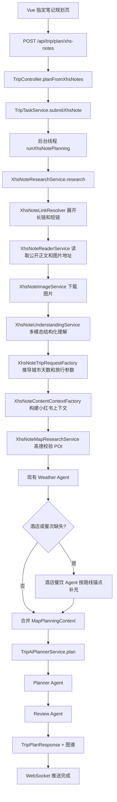

# 小红书指定笔记规划模式：完整实现指南

本文档只描述第二种规划入口：用户只提供小红书笔记链接或分享内容、直接粘贴的攻略笔记、额外要求和出发日期。目的地、旅行天数、交通偏好、住宿偏好等信息由模型从笔记中识别，再生成旅行计划。

目标是让你可以从 Controller 开始，按照真实调用顺序逐层实现。现有自主规划流程尽量不改。

## 一、最终架构决定

### 1. 使用两个提交接口

建议保留现有自主规划接口，并新增指定笔记规划接口：

| 功能 | HTTP 接口 | 请求 DTO | 后端入口 |
|---|---|---|---|
| 自主规划 | `POST /api/trip/plan` | `TripRequest` | `TripTaskService.submit(...)` |
| 指定笔记规划 | `POST /api/trip/plan/xhs-notes` | `XhsNotePlanRequest` | `TripTaskService.submitXhsNote(...)` |

状态查询和 WebSocket 继续共用：

| 功能 | 接口 |
|---|---|
| 查询任务 | `GET /api/trip/status/{taskId}` |
| 订阅进度 | `WS /api/trip/ws/{taskId}` |

这样做的好处：

1. 前端两张输入页分别调用两个接口，不需要在一个大请求里判断模式。
2. `TripRequest` 恢复为自主规划专用 DTO，不再混入小红书指定笔记字段。
3. 新流程出错不会影响旧的 `TripResearchService` Graph。
4. 两种模式仍共用任务状态、WebSocket、Planner Agent、Review Agent 和结果 DTO。

### 2. 不再需要 `TripPlanningMode`

既然 Controller 已经通过 URL 分流，就不再需要：

```text
TripPlanningMode.java
TripRequest.planning_mode
TripRequest.xhs_note_input
```

当前已经写出的这些草稿代码应在实现新接口时删除，避免同时存在“接口分流”和“字段分流”两套判断。

### 3. 指定笔记模式不要求用户 Cookie

- 长链接、短链和 App 分享内容统一解析成公开笔记页面。
- 公开页面读取不携带用户 Cookie。
- 前端指定笔记页面不显示 Cookie 输入框。
- 自主规划搜索小红书仍可继续使用服务端 Cookie 和签名接口。
- 公开页面要求登录、触发验证、笔记删除或仅自己可见时，直接返回真实错误，不切换成搜索 Agent。

## 二、完整调用流程



阅读源码时也按这张图从上往下看，不需要在多个类之间来回猜入口。

## 三、文件清单与实现顺序

按下面顺序创建或修改文件：

```text
1. modules/trip/.../dto/TripRequest.java
2. modules/trip/.../dto/xhsnote/XhsNotePlanRequest.java
3. app/.../api/trip/TripController.java
4. modules/trip/.../service/TripTaskService.java
5. modules/content/.../dto/xhsnote/XhsNoteLink.java
6. modules/content/.../dto/xhsnote/XhsNoteImage.java
7. modules/content/.../dto/xhsnote/XhsNoteRawContent.java
8. modules/content/.../service/XhsHttpHeaders.java
9. modules/content/.../service/XhsNoteLinkResolver.java
10. modules/content/.../service/XhsNotePageParser.java
11. modules/content/.../service/XhsNoteReaderService.java
12. modules/content/.../service/XhsNoteImageService.java
13. modules/ai/.../service/AiMultimodalStructuredOutputService.java
14. modules/trip/.../dto/xhsnote/XhsNoteUnderstandingResult.java
15. modules/trip/.../service/XhsNoteUnderstandingService.java
16. modules/trip/.../service/XhsNoteTripRequestFactory.java
17. modules/trip/.../service/XhsNoteContentContextFactory.java
18. modules/trip/.../service/XhsNoteMapResearchService.java
19. modules/trip/.../service/XhsNoteResearchContext.java
20. modules/trip/.../service/XhsNoteResearchService.java
21. prompts、进度常量和前端 API
22. 单元测试和完整流程测试
```

## 四、第一层：请求 DTO

### 1. 恢复自主规划 `TripRequest`

文件：

```text
modules/trip/src/main/java/com/zkry/trip/dto/TripRequest.java
```

删除 `planning_mode` 和 `xhs_note_input`，恢复为自主规划专用请求：

```java
package com.zkry.trip.dto;

import java.util.List;

public record TripRequest(
    String city,
    List<CityStay> cities,
    String start_date,
    String end_date,
    Integer travel_days,
    String transportation,
    String accommodation,
    List<String> preferences,
    String free_text_input,
    String language
) {
    public List<CityStay> normalizedCities() {
        if (cities != null && !cities.isEmpty()) {
            return cities;
        }
        if (isBlank(city)) {
            return List.of();
        }
        return List.of(new CityStay(city, safeTravelDays()));
    }

    public int safeTravelDays() {
        if (travel_days != null && travel_days > 0) {
            return travel_days;
        }
        if (cities == null || cities.isEmpty()) {
            return 1;
        }
        return cities.stream().mapToInt(CityStay::safeDays).sum();
    }

    public String primaryCity() {
        List<CityStay> normalized = normalizedCities();
        return normalized.isEmpty() ? "" : normalized.getFirst().city();
    }

    public List<String> safePreferences() {
        return preferences == null ? List.of() : preferences;
    }

    public String safeLanguage() {
        return isBlank(language) ? "zh" : language;
    }

    public String safeTransportation() {
        return isBlank(transportation) ? "公共交通" : transportation;
    }

    public String safeAccommodation() {
        return isBlank(accommodation) ? "舒适型酒店" : accommodation;
    }

    private boolean isBlank(String value) {
        return value == null || value.trim().isEmpty();
    }
}
```

### 2. 新增 `XhsNotePlanRequest`

文件：

```text
modules/trip/src/main/java/com/zkry/trip/dto/xhsnote/XhsNotePlanRequest.java
```

这个接口只接收前端真正需要输入的四项内容。城市、天数、交通、住宿和偏好都由笔记理解结果生成。

```java
package com.zkry.trip.dto.xhsnote;

/**
 * 指定笔记规划接口的完整请求。
 *
 * @param share_text 一篇或多篇小红书长链接、短链或 App 完整分享内容
 * @param note_content 用户直接粘贴的攻略笔记正文
 * @param requirement 用户额外要求，例如“不去滇池”“带老人不要太累”
 * @param start_date 出发日期，格式 yyyy-MM-dd
 */
public record XhsNotePlanRequest(
    String share_text,
    String note_content,
    String requirement,
    String start_date
) {
    public String safeShareText() {
        return share_text == null ? "" : share_text.trim();
    }

    public String safeNoteContent() {
        return note_content == null ? "" : note_content.trim();
    }

    public String safeRequirement() {
        return requirement == null ? "" : requirement.trim();
    }

    public String safeStartDate() {
        return start_date == null ? "" : start_date.trim();
    }

    public boolean hasAnyNoteContent() {
        return !safeShareText().isBlank() || !safeNoteContent().isBlank();
    }
}
```

请求示例：

```json
{
  "share_text": "某某发布了一篇小红书笔记，快来看吧！https://xhslink.com/xxxx 复制后打开小红书查看",
  "note_content": "",
  "requirement": "带老人，不去滇池，酒店尽量交通方便",
  "start_date": "2026-08-10"
}
```

业务规则：

1. `share_text` 和 `note_content` 至少填写一项。
2. `start_date` 必填，因为 Weather Agent 和最终日历行程都需要它。
3. 城市和天数不在提交接口校验，而是在多模态理解之后校验。
4. 当前项目按“天”生成计划，所以使用 `start_date`。以后若要规划具体车次或航班，再增加精确到时分的 `departure_time`。

## 五、第二层：TripController

文件：

```text
app/src/main/java/com/zkry/api/trip/TripController.java
```

完整结构如下。旧接口不改 URL，新接口只负责接收新 DTO：

```java
@RestController
@RequestMapping("/api/trip")
public class TripController {

    private static final Logger log = LoggerFactory.getLogger(TripController.class);

    private final TripTaskService tripTaskService;

    public TripController(TripTaskService tripTaskService) {
        this.tripTaskService = tripTaskService;
    }

    /** 自主规划：保持现有接口和流程不变。 */
    @PostMapping("/plan")
    public SubmitTripPlanResponse plan(@RequestBody TripRequest request) {
        log.info("[TripAPI] 收到自主规划请求 city={} days={} preferences={}",
            request == null ? "-" : request.primaryCity(),
            request == null ? 0 : request.safeTravelDays(),
            request == null ? List.of() : request.safePreferences());
        return tripTaskService.submit(request);
    }

    /** 指定笔记规划：进入新的小红书公开笔记读取流程。 */
    @PostMapping("/plan/xhs-notes")
    public SubmitTripPlanResponse planFromXhsNotes(@RequestBody XhsNotePlanRequest request) {
        log.info("[TripAPI] 收到指定笔记规划请求 startDate={} shareTextLength={} noteContentLength={} requirementLength={}",
            request == null ? "-" : request.safeStartDate(),
            request == null ? 0 : request.safeShareText().length(),
            request == null ? 0 : request.safeNoteContent().length(),
            request == null ? 0 : request.safeRequirement().length());
        return tripTaskService.submitXhsNote(request);
    }

    @GetMapping("/status/{taskId}")
    public Map<String, Object> status(@PathVariable String taskId) {
        return tripTaskService.status(taskId);
    }

    @GetMapping("/history")
    public Map<String, Object> history(@RequestParam(defaultValue = "8") int limit) {
        return Map.of("items", List.of());
    }
}
```

注意：Controller 不读取笔记、不调用模型，也不判断酒店是否缺失。它只负责 HTTP 参数和调用任务 Service。

## 六、第三层：TripTaskService

仍然使用现有 `TripTaskService` 管理两种任务，原因是 `status()`、`snapshot()`、`subscribe()` 和 WebSocket 已经依赖它。如果再创建第二套任务 Service，就会复制任务 Map 和订阅逻辑。

### 1. 新增依赖

```java
private final XhsNoteResearchService xhsNoteResearchService;
```

把它加入构造器，其他依赖保持不变。

### 2. 新增提交方法

```java
public SubmitTripPlanResponse submitXhsNote(XhsNotePlanRequest request) {
    validateXhsNoteRequest(request);
    validateXhsNoteRuntimeSettings();

    String taskId = UUID.randomUUID().toString().replace("-", "").substring(0, 8);
    TripTaskState state = new TripTaskState(taskId, xhsNoteRequestPayload(request));
    tasks.put(taskId, state);

    log.info("[TripTask] 创建指定笔记规划任务 taskId={} startDate={} shareTextLength={} noteContentLength={}",
        taskId,
        request.safeStartDate(),
        request.safeShareText().length(),
        request.safeNoteContent().length());

    update(
        taskId,
        TripTaskStatus.PROCESSING,
        TripTaskStage.SUBMITTED,
        TripTaskProgress.SUBMITTED,
        TripTaskMessages.XHS_NOTE_SUBMITTED,
        null,
        null
    );

    CompletableFuture.runAsync(
        () -> runXhsNotePlanning(taskId, request),
        executorService
    );

    return new SubmitTripPlanResponse(
        taskId,
        taskId,
        TripTaskStatus.PROCESSING,
        "/api/trip/ws/" + taskId,
        TripTaskMessages.XHS_NOTE_SUBMITTED
    );
}
```

### 3. 新增后台执行方法

不要在新流程里使用固定 `pause()` 假装推进进度。每个 Service 真正开始执行时，通过 `TripResearchProgressReporter` 上报进度。

```java
private void runXhsNotePlanning(String taskId, XhsNotePlanRequest request) {
    long startedAt = System.currentTimeMillis();
    try {
        update(
            taskId,
            TripTaskStatus.PROCESSING,
            TripTaskStage.INITIALIZING,
            TripTaskProgress.INITIALIZING,
            TripTaskMessages.XHS_NOTE_INITIALIZING,
            null,
            null
        );

        XhsNoteResearchContext researchContext = xhsNoteResearchService.research(
            taskId,
            request,
            (stage, progress, message) -> update(
                taskId,
                TripTaskStatus.PROCESSING,
                stage,
                progress,
                message,
                null,
                null
            )
        );

        if (!researchContext.contentContext().realData()) {
            throw new BizException("指定笔记没有生成可用的小红书内容上下文。");
        }
        if (!researchContext.mapContext().realData()) {
            throw new BizException("指定笔记没有生成可用的高德地图上下文。");
        }
        TripRequest inferredTrip = researchContext.tripRequest();

        update(
            taskId,
            TripTaskStatus.PROCESSING,
            TripTaskStage.PLANNING,
            TripTaskProgress.PLANNING,
            TripTaskMessages.PLANNING,
            null,
            null
        );

        TripPlanResponse response = tripAiPlannerService.plan(
            taskId,
            inferredTrip,
            researchContext.mapContext(),
            researchContext.contentContext()
        ).orElseThrow(() -> new BizException("Planner Agent 未返回可解析的旅行计划。"));

        update(
            taskId,
            TripTaskStatus.PROCESSING,
            TripTaskStage.GRAPH_BUILDING,
            TripTaskProgress.GRAPH_BUILDING,
            TripTaskMessages.GRAPH_BUILDING,
            null,
            null
        );

        update(
            taskId,
            TripTaskStatus.COMPLETED,
            TripTaskStage.COMPLETED,
            TripTaskProgress.DONE,
            TripTaskMessages.COMPLETED,
            response,
            null
        );
        log.info("[TripTask] 指定笔记规划完成 taskId={} elapsedMs={}",
            taskId, System.currentTimeMillis() - startedAt);
    } catch (Exception ex) {
        log.error("[TripTask] 指定笔记规划失败 taskId={} elapsedMs={} reason={}",
            taskId, System.currentTimeMillis() - startedAt, ex.getMessage(), ex);
        update(
            taskId,
            TripTaskStatus.FAILED,
            TripTaskStage.FAILED,
            TripTaskProgress.DONE,
            TripTaskMessages.FAILED,
            null,
            ex.getMessage()
        );
    }
}
```

### 4. 分开运行时配置校验

现有自主规划校验继续要求：小红书 Cookie、高德 Key、AI Key、模型名称。

指定笔记模式只要求：高德 Key、AI Key、支持图片输入的模型名称。

请求本身只校验四个输入字段，不在提交阶段校验城市和旅行天数：

```java
private void validateXhsNoteRequest(XhsNotePlanRequest request) {
    if (request == null) {
        throw new BizException("指定笔记规划请求不能为空。");
    }
    if (!request.hasAnyNoteContent()) {
        throw new BizException("请填写小红书笔记链接或攻略笔记内容。");
    }
    if (request.safeStartDate().isBlank()) {
        throw new BizException("请选择出发日期。");
    }
    try {
        LocalDate.parse(request.safeStartDate());
    } catch (DateTimeParseException ex) {
        throw new BizException("出发日期格式必须为 yyyy-MM-dd。");
    }
}
```

```java
private void validateXhsNoteRuntimeSettings() {
    List<String> missing = new ArrayList<>();
    if (!runtimeSettingsService.hasText(TripstarSettingKeys.AMAP_WEB_KEY)) {
        missing.add("高德地图 Web Service Key");
    }
    if (!runtimeSettingsService.hasText(TripstarSettingKeys.OPENAI_API_KEY)) {
        missing.add("AI API Key");
    }
    if (!runtimeSettingsService.hasText(TripstarSettingKeys.OPENAI_MODEL)) {
        missing.add("支持多模态的 AI 模型名称");
    }
    if (!missing.isEmpty()) {
        throw new BizException("缺少运行时配置：" + String.join("、", missing));
    }
}
```

### 5. 修改 `TripTaskState` 的请求保存方式

当前状态对象固定保存 `TripRequest`。新增请求类型后，改成保存请求快照 Map：

```java
private static final class TripTaskState {

    private final String taskId;
    private final Map<String, Object> requestPayload;

    private TripTaskState(String taskId, Map<String, Object> requestPayload) {
        this.taskId = taskId;
        this.requestPayload = new LinkedHashMap<>(requestPayload);
    }

    private Map<String, Object> requestPayload() {
        return new LinkedHashMap<>(requestPayload);
    }

    // status、stage、progress、result、subscriber 和 toEvent(...) 保持现有实现。
}
```

旧 `submit(TripRequest)` 只需要把创建状态的一行改为：

```java
TripTaskState state = new TripTaskState(taskId, autonomousRequestPayload(request));
```

分别准备两个请求快照方法。日志不要输出完整分享文案，但内存任务快照可以保留请求，方便失败后前端重新提交。

## 七、第四层：content 模块读取公开笔记

content 模块只负责小红书数据，不允许依赖 trip 模块。因此 `XhsNoteReaderService` 不接收 `XhsNotePlanRequest`，只接收字符串并返回 content DTO。

先增加统一浏览器请求头常量：

```java
package com.zkry.content.service;

public final class XhsHttpHeaders {

    public static final String BROWSER_USER_AGENT =
        "Mozilla/5.0 (Windows NT 10.0; Win64; x64) "
            + "AppleWebKit/537.36 (KHTML, like Gecko) "
            + "Chrome/131.0.0.0 Safari/537.36";

    private XhsHttpHeaders() {
    }
}
```

### 1. `XhsNoteLink`

```java
package com.zkry.content.dto.xhsnote;

public record XhsNoteLink(
    String originalInput,
    String extractedUrl,
    String finalUrl,
    String noteId,
    String xsecToken,
    String xsecSource
) {
    public boolean readable() {
        return noteId != null && !noteId.isBlank()
            && finalUrl != null && !finalUrl.isBlank();
    }
}
```

### 2. `XhsNoteImage`

```java
package com.zkry.content.dto.xhsnote;

public record XhsNoteImage(
    int index,
    String sourceUrl,
    String localPath,
    String mimeType,
    boolean downloaded,
    String error
) {
}
```

### 3. `XhsNoteRawContent`

```java
package com.zkry.content.dto.xhsnote;

import java.util.List;

public record XhsNoteRawContent(
    String noteId,
    String sourceUrl,
    String title,
    String description,
    String author,
    List<XhsNoteImage> images
) {
    public List<XhsNoteImage> safeImages() {
        return images == null ? List.of() : images;
    }

    public boolean hasUsableContent() {
        return description != null && !description.isBlank()
            || safeImages().stream().anyMatch(XhsNoteImage::downloaded);
    }
}
```

### 4. `XhsNoteLinkResolver`

职责只有三个：从整段分享内容提取全部 URL、展开短链、解析最终 `noteId`。

```java
@Service
public class XhsNoteLinkResolver {

    private static final Pattern URL_PATTERN = Pattern.compile(
        "https?://[^\\s\\u3000]+",
        Pattern.CASE_INSENSITIVE
    );

    private static final int MAX_REDIRECTS = 5;
    private final HttpClient httpClient = HttpClient.newBuilder()
        .followRedirects(HttpClient.Redirect.NEVER)
        .connectTimeout(Duration.ofSeconds(10))
        .build();

    public List<XhsNoteLink> resolveAll(String shareText) {
        List<String> urls = extractSupportedUrls(shareText);
        if (urls.isEmpty()) {
            throw new BizException("未找到小红书链接，请粘贴包含链接的完整分享内容。");
        }

        Map<String, XhsNoteLink> uniqueNotes = new LinkedHashMap<>();
        for (String url : urls) {
            XhsNoteLink link = resolveOne(shareText, url);
            if (!link.readable()) {
                throw new BizException("无法从小红书链接解析笔记 ID：" + mask(url));
            }
            uniqueNotes.putIfAbsent(link.noteId(), link);
        }
        return List.copyOf(uniqueNotes.values());
    }

    private XhsNoteLink resolveOne(String originalInput, String extractedUrl) {
        URI source = validateXhsUri(extractedUrl);
        URI target = isShortLink(source) ? followRedirects(source) : source;
        validateXhsUri(target.toString());

        return new XhsNoteLink(
            originalInput,
            extractedUrl,
            target.toString(),
            extractNoteId(target),
            queryValue(target, "xsec_token"),
            queryValue(target, "xsec_source")
        );
    }

    // extractSupportedUrls：从任意多行分享文案中提取所有 http/https URL。
    // followRedirects：处理 301/302/303/307/308，每次跳转后重新校验域名。
    // validateXhsUri：只允许 http/https 和 xhslink.com、xiaohongshu.com 官方域名。
    // extractNoteId：支持 /explore/{id} 和 /discovery/item/{id}。
    // queryValue：使用 URI 查询参数解析，不要手写 split("&")。
}
```

实现边界：

- App 分享文案中包含 `xhslink.com` 短链时可以解析。
- 分享文案可以有换行，也可以同时包含多篇笔记。
- 如果只有无法识别的纯口令，没有 URL 或 noteId，第一版明确提示用户粘贴完整分享内容。
- 短链请求不携带 Cookie。
- 域名白名单必须检查每一次跳转，防止 SSRF。

### 5. `XhsNotePageParser`

页面解析单独放一个类，因为它是最容易随小红书页面结构变化的地方，也最需要单元测试。

```java
@Component
public class XhsNotePageParser {

    private final ObjectMapper objectMapper;

    public XhsNotePageParser(ObjectMapper objectMapper) {
        this.objectMapper = objectMapper;
    }

    public XhsNoteRawContent parse(XhsNoteLink link, String html) {
        if (html == null || html.isBlank()) {
            throw new BizException("小红书公开页面为空，noteId=" + link.noteId());
        }

        Document document = Jsoup.parse(html);
        JsonNode initialState = readInitialState(document);
        JsonNode noteNode = findNoteNode(initialState, link.noteId());
        if (noteNode == null || noteNode.isMissingNode()) {
            throw new BizException("公开页面中没有找到笔记数据，可能需要登录或已触发验证。");
        }

        return new XhsNoteRawContent(
            link.noteId(),
            link.finalUrl(),
            text(noteNode, "title"),
            text(noteNode, "desc"),
            authorName(noteNode),
            imageList(noteNode)
        );
    }

    // readInitialState：从 script 标签中定位页面内嵌状态，再交给 Jackson 解析。
    // findNoteNode：根据真实页面样本确认 JSON 路径，不要在多个路径之间静默兜底。
    // imageList：提取全部图片 URL，不只取首图。
}
```

这里必须拿一篇真实公开笔记保存 HTML，再根据实际的 `__INITIAL_STATE__` 结构完成 `findNoteNode(...)`。不要凭猜测堆很多 JSON 路径兜底。

content 模块需要增加 Jsoup 依赖，用 Jsoup 找 script、canonical 等 HTML 节点，用 Jackson 解析 JSON。

### 6. `XhsNoteReaderService`

```java
@Service
public class XhsNoteReaderService {

    private final XhsNoteLinkResolver linkResolver;
    private final XhsNotePageParser pageParser;
    private final HttpClient httpClient;

    public List<XhsNoteRawContent> readAll(String shareText) {
        List<XhsNoteLink> links = linkResolver.resolveAll(shareText);
        List<XhsNoteRawContent> notes = new ArrayList<>();

        for (XhsNoteLink link : links) {
            long startedAt = System.currentTimeMillis();
            log.info("[XHS-NOTE] 开始读取公开笔记 noteId={} finalHost={}",
                link.noteId(), URI.create(link.finalUrl()).getHost());
            String html = requestPublicPage(link.finalUrl());
            XhsNoteRawContent note = pageParser.parse(link, html);
            notes.add(note);
            log.info("[XHS-NOTE] 公开笔记读取成功 noteId={} descLength={} imageCount={} elapsedMs={}",
                note.noteId(),
                note.description() == null ? 0 : note.description().length(),
                note.safeImages().size(),
                System.currentTimeMillis() - startedAt);
        }
        return notes;
    }

    private String requestPublicPage(String url) {
        HttpRequest request = HttpRequest.newBuilder(URI.create(url))
            .timeout(Duration.ofSeconds(20))
            .header("User-Agent", XhsHttpHeaders.BROWSER_USER_AGENT)
            .header("Accept", "text/html,application/xhtml+xml")
            .header("Accept-Language", "zh-CN,zh;q=0.9")
            .GET()
            .build();
        try {
            HttpResponse<String> response = httpClient.send(
                request,
                HttpResponse.BodyHandlers.ofString(StandardCharsets.UTF_8)
            );
            if (response.statusCode() < 200 || response.statusCode() >= 300) {
                throw new BizException(
                    "小红书公开页面读取失败，HTTP status=" + response.statusCode()
                );
            }
            String html = response.body();
            if (isLoginOrVerificationPage(html)) {
                throw new BizException("该笔记当前要求登录或安全验证，无法公开读取。");
            }
            return html;
        } catch (InterruptedException ex) {
            Thread.currentThread().interrupt();
            throw new BizException("小红书公开页面读取被中断。", ex);
        } catch (IOException ex) {
            throw new BizException("小红书公开页面读取失败：" + ex.getMessage(), ex);
        }
    }
}
```

`XhsHttpHeaders.BROWSER_USER_AGENT` 放到 content 模块的常量类中，不要在多个请求类里重复写浏览器 UA。

### 7. `XhsNoteImageService`

```java
@Service
public class XhsNoteImageService {

    private static final int MAX_IMAGES_PER_NOTE = 12;
    private static final int MAX_IMAGES_PER_TASK = 40;
    private static final long MAX_IMAGE_BYTES = 8L * 1024 * 1024;

    private final HttpClient httpClient = HttpClient.newBuilder()
        .connectTimeout(Duration.ofSeconds(10))
        .build();

    public List<XhsNoteRawContent> downloadAll(
        String taskId,
        List<XhsNoteRawContent> notes
    ) {
        Path taskDir = Path.of("./temp/xhs-note-images", taskId)
            .toAbsolutePath()
            .normalize();
        try {
            Files.createDirectories(taskDir);
        } catch (IOException ex) {
            throw new BizException("创建小红书图片临时目录失败。", ex);
        }

        List<XhsNoteRawContent> result = new ArrayList<>();
        int remaining = MAX_IMAGES_PER_TASK;
        for (XhsNoteRawContent note : notes) {
            List<XhsNoteImage> downloaded = new ArrayList<>();
            int noteLimit = Math.min(MAX_IMAGES_PER_NOTE, remaining);
            for (XhsNoteImage image : note.safeImages().stream().limit(noteLimit).toList()) {
                downloaded.add(downloadOne(taskDir, note, image));
                remaining--;
            }
            result.add(new XhsNoteRawContent(
                note.noteId(),
                note.sourceUrl(),
                note.title(),
                note.description(),
                note.author(),
                downloaded
            ));
        }
        return result;
    }

    public void cleanup(String taskId) {
        Path taskDir = Path.of("./temp/xhs-note-images", taskId)
            .toAbsolutePath()
            .normalize();
        if (!Files.exists(taskDir)) {
            return;
        }
        try (Stream<Path> paths = Files.walk(taskDir)) {
            paths.sorted(Comparator.reverseOrder()).forEach(path -> {
                try {
                    Files.deleteIfExists(path);
                } catch (IOException ex) {
                    log.warn("[XHS-NOTE-IMAGE] 临时文件删除失败 path={} reason={}",
                        path, ex.getMessage());
                }
            });
        } catch (IOException ex) {
            log.warn("[XHS-NOTE-IMAGE] 临时目录清理失败 taskId={} reason={}",
                taskId, ex.getMessage());
        }
    }

    private XhsNoteImage downloadOne(
        Path taskDir,
        XhsNoteRawContent note,
        XhsNoteImage image
    ) {
        try {
            HttpRequest request = HttpRequest.newBuilder(URI.create(image.sourceUrl()))
                .timeout(Duration.ofSeconds(20))
                .header("User-Agent", XhsHttpHeaders.BROWSER_USER_AGENT)
                .header("Referer", note.sourceUrl())
                .GET()
                .build();
            HttpResponse<byte[]> response = httpClient.send(
                request,
                HttpResponse.BodyHandlers.ofByteArray()
            );
            String mimeType = response.headers()
                .firstValue("Content-Type")
                .orElse("application/octet-stream")
                .split(";", 2)[0];
            if (response.statusCode() < 200 || response.statusCode() >= 300) {
                throw new IOException("HTTP status=" + response.statusCode());
            }
            if (!mimeType.startsWith("image/")) {
                throw new IOException("响应不是图片，contentType=" + mimeType);
            }
            if (response.body().length > MAX_IMAGE_BYTES) {
                throw new IOException("图片超过大小限制");
            }

            Path file = taskDir.resolve(note.noteId() + "-" + image.index() + extension(mimeType));
            Files.write(file, response.body());
            return new XhsNoteImage(
                image.index(), image.sourceUrl(), file.toString(), mimeType, true, ""
            );
        } catch (InterruptedException ex) {
            Thread.currentThread().interrupt();
            throw new BizException("小红书图片下载被中断，noteId="
                + note.noteId() + "，imageIndex=" + image.index());
        } catch (Exception ex) {
            throw new BizException("小红书图片下载失败，noteId="
                + note.noteId() + "，imageIndex=" + image.index()
                + "，reason=" + ex.getMessage());
        }
    }

    private String extension(String mimeType) {
        return switch (mimeType) {
            case "image/png" -> ".png";
            case "image/webp" -> ".webp";
            default -> ".jpg";
        };
    }
}
```

当前实现采用严格完整性策略：任意一张图片下载失败都立即停止任务。临时图片默认保存在
`backend_java/temp/xhs-note-images/{taskId}`，可通过环境变量 `XHS_NOTE_IMAGE_DIR` 覆盖；`temp/`
已经加入 `.gitignore`，不会被提交到开源仓库。本地默认保留任务图片，便于根据 AI trace 中的
绝对路径逐张核对；生产环境设置 `XHS_NOTE_IMAGE_CLEANUP_ENABLED=true` 即可在任务后自动清理。

## 八、第五层：多模态结构化输出

### 1. AI 模块新增通用服务

文件：

```text
modules/ai/src/main/java/com/zkry/ai/service/AiMultimodalStructuredOutputService.java
```

它只负责：文本和图片发给同一个 `ChatModel`，再用 `BeanOutputConverter` 转换 DTO。

```java
@Service
public class AiMultimodalStructuredOutputService {

    private final AiTextService aiTextService;
    private final AiPromptTraceService promptTraceService;

    public <T> Optional<T> callForObject(
        TripstarAgent operation,
        Class<T> outputType,
        String systemPrompt,
        String userPrompt,
        List<Media> media,
        String mediaDescription,
        String threadId
    ) {
        Optional<ChatModel> model = aiTextService.chatModel();
        if (model.isEmpty()) {
            return Optional.empty();
        }

        BeanOutputConverter<T> converter = new BeanOutputConverter<>(outputType);
        UserMessage userMessage = UserMessage.builder()
            .text(userPrompt)
            .media(media == null ? List.of() : media)
            .build();

        Prompt prompt = new Prompt(List.of(
            new SystemMessage(systemPrompt),
            userMessage
        ));

        try {
            ChatResponse response = model.get().call(prompt);
            String text = response.getResult().getOutput().getText();
            T result = converter.convert(text);
            // trace 文件记录 systemPrompt、userPrompt、图片路径/MIME/大小和模型输出；不复制图片二进制。
            return Optional.ofNullable(result);
        } catch (Exception ex) {
            // 记录真实模型输出或异常，不增加手写 JSON 修复器。
            return Optional.empty();
        }
    }
}
```

Spring AI 2.0.0-M1 的 `Media`、`UserMessage` 构造 API需要以项目实际依赖为准，编译时若方法签名不同，只调整这一处。

多模态理解阶段不需要工具，所以直接调用 `ChatModel` 比套一层 ReactAgent 更清楚。后面的 POI、天气、酒店、Planner、Review 仍使用 ReactAgent。

### 2. 结构化理解 DTO

保留你已经创建的三个 record，但补全安全方法：

```java
public record XhsNoteUnderstandingResult(
    String city,
    List<CityStay> city_stays,
    Integer travel_days,
    String transportation,
    String accommodation,
    List<String> preferences,
    List<XhsNoteDayRoute> day_routes,
    List<XhsNotePlace> attractions,
    List<XhsNotePlace> hotels,
    List<XhsNotePlace> restaurants,
    List<String> transport_notes,
    List<String> excluded_places,
    List<String> warnings,
    String summary
) {
    public List<CityStay> safeCityStays() {
        if (city_stays != null && !city_stays.isEmpty()) {
            return city_stays;
        }
        if (city == null || city.isBlank()) {
            return List.of();
        }
        int days = resolvedTravelDays();
        return days > 0 ? List.of(new CityStay(city, days)) : List.of();
    }

    public int resolvedTravelDays() {
        if (travel_days != null && travel_days > 0) {
            return travel_days;
        }
        int cityDays = city_stays == null
            ? 0
            : city_stays.stream().mapToInt(CityStay::safeDays).sum();
        if (cityDays > 0) {
            return cityDays;
        }
        return safeDayRoutes().stream()
            .map(XhsNoteDayRoute::day)
            .filter(Objects::nonNull)
            .mapToInt(Integer::intValue)
            .max()
            .orElse(0);
    }

    public String safeTransportation() {
        return transportation == null || transportation.isBlank()
            ? "公共交通"
            : transportation;
    }

    public String safeAccommodation() {
        return accommodation == null || accommodation.isBlank()
            ? "舒适型酒店"
            : accommodation;
    }

    public List<String> safePreferences() {
        return preferences == null ? List.of() : preferences;
    }

    public List<XhsNoteDayRoute> safeDayRoutes() {
        return day_routes == null ? List.of() : day_routes;
    }

    public List<XhsNotePlace> safeAttractions() {
        return attractions == null ? List.of() : attractions;
    }

    public List<XhsNotePlace> safeHotels() {
        return hotels == null ? List.of() : hotels;
    }

    public List<XhsNotePlace> safeRestaurants() {
        return restaurants == null ? List.of() : restaurants;
    }

    public boolean needsHotelSupplement(int travelDays) {
        return safeHotels().isEmpty()
            || safeDayRoutes().stream().limit(travelDays)
                .anyMatch(route -> route.hotel_area() == null || route.hotel_area().isBlank());
    }

    public boolean needsMealSupplement(int travelDays) {
        return safeDayRoutes().stream().limit(travelDays).anyMatch(route ->
            isBlank(route.breakfast_area())
                || isBlank(route.lunch_area())
                || isBlank(route.dinner_area())
        );
    }

    private boolean isBlank(String value) {
        return value == null || value.isBlank();
    }
}
```

### 3. 领域服务 `XhsNoteUnderstandingService`

文件：

```text
modules/trip/src/main/java/com/zkry/trip/service/XhsNoteUnderstandingService.java
```

```java
@Service
public class XhsNoteUnderstandingService {

    private final AiMultimodalStructuredOutputService multimodalService;
    private final PromptResourceService promptResourceService;

    public XhsNoteUnderstandingResult understand(
        String taskId,
        XhsNotePlanRequest request,
        List<XhsNoteRawContent> notes
    ) {
        List<Media> media = buildMedia(notes);
        String systemPrompt = promptResourceService.load(TripstarPrompt.XHS_NOTE_VISION_SYSTEM);
        String userPrompt = promptResourceService.render(
            TripstarPrompt.XHS_NOTE_VISION_USER,
            Map.of(
                TripstarPromptVariable.START_DATE, request.safeStartDate(),
                TripstarPromptVariable.XHS_NOTE_TEXT,
                    noteText(notes, request.safeNoteContent()),
                TripstarPromptVariable.XHS_NOTE_REQUIREMENT,
                    request.safeRequirement(),
                TripstarPromptVariable.FORMAT,
                    new BeanOutputConverter<>(XhsNoteUnderstandingResult.class).getFormat()
            )
        );

        return multimodalService.callForObject(
            TripstarAgent.XHS_NOTE_UNDERSTANDING,
            XhsNoteUnderstandingResult.class,
            systemPrompt,
            userPrompt,
            media,
            buildMediaDescription(notes),
            taskId + "-xhs-note-understanding"
        ).orElseThrow(() -> new BizException("多模态模型没有返回可解析的笔记理解结果。"));
    }
}
```

`noteText(...)` 必须把每篇笔记的 noteId、标题、正文、图片序号和用户直接粘贴的攻略正文写清楚，使模型知道图片属于哪一篇笔记。

模型在这一阶段还必须完成以下推导：

1. 从地点名称、标题和图片识别目的地城市。
2. 优先读取笔记里的 Day01、Day02；没有明确 Day 时，根据路线密度给出合理天数。
3. 从笔记和用户要求提取交通、住宿和旅行偏好。
4. 城市无法确认或旅行天数无法推导时写入 `warnings`，Java 层随后明确失败。

## 九、第六层：转换为 Planner 能读取的上下文

### 1. `XhsNoteTripRequestFactory`

文件：

```text
modules/trip/src/main/java/com/zkry/trip/service/XhsNoteTripRequestFactory.java
```

这个工厂是“最小前端输入”和“现有 Planner 输入”之间的桥梁。它不调用 LLM，只校验模型结果并构造 `TripRequest`：

```java
@Component
public class XhsNoteTripRequestFactory {

    public TripRequest create(
        XhsNotePlanRequest source,
        XhsNoteUnderstandingResult understanding
    ) {
        List<CityStay> cities = understanding.safeCityStays();
        if (cities.isEmpty()) {
            throw new BizException("无法从笔记中识别目的地城市，请在要求中补充目的地。");
        }

        int travelDays = understanding.resolvedTravelDays();
        if (travelDays <= 0) {
            throw new BizException("无法从笔记中识别旅行天数，请在要求中补充天数。");
        }
        int cityDays = cities.stream().mapToInt(CityStay::safeDays).sum();
        if (cityDays != travelDays) {
            throw new BizException(
                "笔记识别出的城市停留天数与总天数不一致，请检查多模态输出。"
            );
        }

        LocalDate startDate = LocalDate.parse(source.safeStartDate());
        LocalDate endDate = startDate.plusDays(travelDays - 1L);

        return new TripRequest(
            cities.getFirst().city(),
            cities,
            startDate.toString(),
            endDate.toString(),
            travelDays,
            understanding.safeTransportation(),
            understanding.safeAccommodation(),
            understanding.safePreferences(),
            source.safeRequirement(),
            "zh"
        );
    }
}
```

这里使用默认“公共交通”和“舒适型酒店”，只是当笔记完全没有提及时保证现有 Planner DTO 可用；它们不是前端必填项。

### 2. `XhsNoteContentContextFactory`

这个类把多模态结果转换成现有 `ContentPlanningContext`，因此后面的 Planner Agent 不需要新增一套输入协议。

```java
@Component
public class XhsNoteContentContextFactory {

    public ContentPlanningContext create(
        TripRequest trip,
        XhsNoteUnderstandingResult understanding
    ) {
        List<ContentAttractionCandidate> attractions = understanding.safeAttractions()
            .stream()
            .map(place -> new ContentAttractionCandidate(
                place.name(),
                place.name(),
                "",
                place.reason(),
                null,
                false,
                "",
                Map.of(
                    "source_note_id", safe(place.source_note_id()),
                    "day", place.day() == null ? 0 : place.day()
                )
            ))
            .toList();

        ContentCityContext city = new ContentCityContext(
            trip.primaryCity(),
            "用户指定小红书笔记",
            TravelDataSource.XHS_NOTE,
            JsonUtils.toJsonString(understanding),
            attractions,
            understanding.summary()
        );

        return new ContentPlanningContext(
            List.of(city),
            true,
            TravelDataSource.XHS_NOTE,
            "已读取并理解用户指定的小红书笔记。"
        );
    }
}
```

在 `TravelDataSource` 增加：

```java
public static final String XHS_NOTE = "xhs-note";
```

## 十、第七层：高德校验、天气与缺失补充

文件：

```text
modules/trip/src/main/java/com/zkry/trip/service/XhsNoteMapResearchService.java
```

这个 Service 由 Java 明确控制调用顺序。POI 补全使用高德 Service，天气和酒店餐饮继续使用现有 Agent：

```text
POI 补全 Service
  -> Weather Agent
  -> 判断酒店/餐次是否缺失
  -> 缺失时调用酒店餐饮 Agent
  -> 合并 MapPlanningContext
```

核心结构：

```java
@Service
public class XhsNoteMapResearchService {

    private final AiStructuredOutputService structuredOutputService;
    private final PromptResourceService promptResourceService;
    private final XhsNotePoiEnrichmentService poiEnrichmentService;
    private final AmapWeatherTools amapWeatherTools;
    private final AmapHotelTools amapHotelTools;

    public MapPlanningContext research(
        String taskId,
        TripRequest trip,
        XhsNoteUnderstandingResult understanding,
        ContentPlanningContext contentContext,
        TripResearchProgressReporter reporter
    ) {
        reporter.report(
            TripTaskStage.AMAP_POI_SEARCH,
            TripTaskProgress.AMAP_POI_SEARCH,
            TripTaskMessages.XHS_NOTE_POI_VALIDATE
        );
        MapPlanningContext poiContext = poiEnrichmentService.enrich(taskId, trip, understanding);

        reporter.report(
            TripTaskStage.WEATHER_SEARCH,
            TripTaskProgress.WEATHER_SEARCH,
            TripTaskMessages.WEATHER_SEARCH
        );
        MapAgentResult weatherResult = callWeatherAgent(taskId, trip);

        MapAgentResult supplementResult = null;
        boolean missingHotel = understanding.needsHotelSupplement(trip.safeTravelDays());
        boolean missingMeals = understanding.needsMealSupplement(trip.safeTravelDays());
        if (missingHotel || missingMeals) {
            reporter.report(
                TripTaskStage.HOTEL_SEARCH,
                TripTaskProgress.HOTEL_SEARCH,
                TripTaskMessages.XHS_NOTE_HOTEL_FOOD
            );
            supplementResult = callHotelFoodAgent(
                taskId,
                trip,
                understanding,
                missingHotel,
                missingMeals
            );
        } else {
            log.info("[XHS-NOTE-MAP] 笔记已有酒店和餐饮信息，跳过补充 taskId={}", taskId);
        }

        return mergeMapContexts(
            poiContext,
            weatherResult.map_context(),
            supplementResult == null ? null : supplementResult.map_context()
        );
    }
}
```

### POI 补全 Service

输入包括：

- 笔记识别出的景点、酒店、餐厅。
- 地点所属城市。
- 地点原始名称。
- 高德 `AmapMapContextService`。

每个地点使用 `city_limit=true` 限定城市，并以 `limit=1` 请求高德相关度最高的第一条结果。
Service 直接补充名称、地址、经纬度、评分和图片，并把景点、酒店、餐饮分别放入 `MapCityContext`。
高德没有结果或结果缺少经纬度时立即失败，不调用大模型判断，也不提供替代数据。

### Weather Agent

继续复用：

```text
TripstarAgent.AMAP_WEATHER_RESEARCH
TripstarPrompt.RESEARCH_AMAP_WEATHER_SYSTEM
TripstarPrompt.RESEARCH_AMAP_WEATHER_USER
AmapWeatherTools
```

这就是“复用现有 Weather Agent”，不是重新写天气 HTTP 请求。

### 酒店餐饮补充 Agent

只有缺失时才调用。Prompt 必须带每天的路线锚点：

```text
早餐：靠近酒店或当天第一个景点
午餐：靠近当天中间景点
晚餐：靠近当天最后一个景点或夜间活动区域
酒店：优先靠近当天最后一个景点，同时兼顾第二天第一个景点
```

不要只传“昆明酒店”这种宽泛关键词。将下面内容组织成 `route_anchors` 变量：

```text
Day1 first=翠湖 middle=云南大学 last=南强街
Day2 first=石林 middle=石林风景区 last=昆明南站
```

在 `TripstarAgent` 增加两个统一名称。其中理解阶段使用直接多模态 ChatModel，枚举值只用于统一日志和 trace 标识：

```java
XHS_NOTE_UNDERSTANDING("xhs-note-understanding-agent"),
XHS_NOTE_HOTEL_FOOD("xhs-note-hotel-food-agent")
```

现有 `AMAP_WEATHER_RESEARCH` 直接复用。

## 十一、第八层：XhsNoteResearchService 主流程

### 1. 返回对象

```java
package com.zkry.trip.service;

import com.zkry.content.dto.ContentPlanningContext;
import com.zkry.map.dto.MapPlanningContext;
import com.zkry.trip.dto.TripRequest;
import com.zkry.trip.dto.xhsnote.XhsNoteUnderstandingResult;

public record XhsNoteResearchContext(
    TripRequest tripRequest,
    ContentPlanningContext contentContext,
    MapPlanningContext mapContext,
    XhsNoteUnderstandingResult understanding
) {
}
```

### 2. 完整编排 Service

```java
@Service
public class XhsNoteResearchService {

    private final XhsNoteReaderService noteReaderService;
    private final XhsNoteImageService imageService;
    private final XhsNoteUnderstandingService understandingService;
    private final XhsNoteTripRequestFactory tripRequestFactory;
    private final XhsNoteContentContextFactory contentContextFactory;
    private final XhsNoteMapResearchService mapResearchService;

    public XhsNoteResearchContext research(
        String taskId,
        XhsNotePlanRequest request,
        TripResearchProgressReporter reporter
    ) {
        reporter.report(
            TripTaskStage.XHS_NOTE_RESOLVE,
            TripTaskProgress.XHS_NOTE_RESOLVE,
            TripTaskMessages.XHS_NOTE_RESOLVE
        );

        List<XhsNoteRawContent> notes = new ArrayList<>();
        if (!request.safeShareText().isBlank()) {
            notes.addAll(noteReaderService.readAll(request.safeShareText()));
        }
        if (!request.safeNoteContent().isBlank()) {
            notes.add(pastedNote(request.safeNoteContent()));
        }
        if (notes.isEmpty()) {
            throw new BizException("没有读取到任何小红书笔记内容。");
        }

        try {
            reporter.report(
                TripTaskStage.XHS_NOTE_IMAGE,
                TripTaskProgress.XHS_NOTE_IMAGE,
                TripTaskMessages.XHS_NOTE_IMAGE
            );
            List<XhsNoteRawContent> downloaded = imageService.downloadAll(taskId, notes);

            reporter.report(
                TripTaskStage.XHS_NOTE_UNDERSTANDING,
                TripTaskProgress.XHS_NOTE_UNDERSTANDING,
                TripTaskMessages.XHS_NOTE_UNDERSTANDING
            );
            XhsNoteUnderstandingResult understanding = understandingService.understand(
                taskId,
                request,
                downloaded
            );

            TripRequest inferredTrip = tripRequestFactory.create(
                request,
                understanding
            );
            log.info("[XHS-NOTE] 已从笔记推导旅行参数 taskId={} cities={} days={} transportation={} accommodation={}",
                taskId,
                inferredTrip.normalizedCities(),
                inferredTrip.safeTravelDays(),
                inferredTrip.safeTransportation(),
                inferredTrip.safeAccommodation());

            ContentPlanningContext contentContext = contentContextFactory.create(
                inferredTrip,
                understanding
            );
            MapPlanningContext mapContext = mapResearchService.research(
                taskId,
                inferredTrip,
                understanding,
                contentContext,
                reporter
            );

            return new XhsNoteResearchContext(
                inferredTrip,
                contentContext,
                mapContext,
                understanding
            );
        } finally {
            imageService.cleanup(taskId);
        }
    }
}
```

这个类是指定笔记模式最重要的阅读入口。它没有 Graph 跳转，先把多模态链路跑清楚。现有自主规划已经提供 Spring AI Alibaba Graph 的学习样本，不需要第一版就再复制一套 Graph。

## 十二、Prompt 文件

新增：

```text
modules/ai/src/main/resources/prompts/tripstar/xhs-note-vision-system.md
modules/ai/src/main/resources/prompts/tripstar/xhs-note-vision-user.md
modules/ai/src/main/resources/prompts/tripstar/xhs-note-hotel-food-system.md
modules/ai/src/main/resources/prompts/tripstar/xhs-note-hotel-food-user.md
```

在 `TripstarPrompt` 增加路径常量，在 `TripstarPromptVariable` 增加：

```java
public static final String START_DATE = "start_date";
public static final String XHS_NOTE_TEXT = "xhs_note_text";
public static final String XHS_NOTE_REQUIREMENT = "xhs_note_requirement";
public static final String ROUTE_ANCHORS = "route_anchors";
public static final String MISSING_HOTEL = "missing_hotel";
public static final String MISSING_MEALS = "missing_meals";
```

多模态系统提示词必须强调：

1. 正文和图片具有同等重要性。
2. 图片里的 Day01、Day02、路线图、菜单和酒店名称都要读取。
3. 不要把“避雷”“不推荐”“不要去”误当推荐。
4. 用户 requirement 的排除条件优先级最高。
5. 必须从笔记推导目的地城市、城市停留天数、总天数、交通方式、住宿偏好和旅行偏好。
6. 没有明确 Day 标记时，可以根据景点数量和路线密度推荐合理天数，但必须在 summary 中说明。
7. 不确定的信息放入 `warnings`，不要编造地点。
8. 最终严格按 `{{format}}` 输出。

## 十三、进度阶段和前端映射

在 `TripTaskStage` 增加：

```java
public static final String XHS_NOTE_RESOLVE = "xhs_note_resolve";
public static final String XHS_NOTE_IMAGE = "xhs_note_image";
public static final String XHS_NOTE_UNDERSTANDING = "xhs_note_understanding";
```

在 `TripTaskProgress` 增加，三个阶段都必须落在前端“景点资料”区间：

```java
public static final int XHS_NOTE_RESOLVE = 18;
public static final int XHS_NOTE_IMAGE = 23;
public static final int XHS_NOTE_UNDERSTANDING = 28;
```

在 `TripTaskMessages` 增加：

```java
public static final String XHS_NOTE_SUBMITTED = "指定笔记规划任务已提交...";
public static final String XHS_NOTE_INITIALIZING = "正在初始化小红书指定笔记规划流程...";
public static final String XHS_NOTE_RESOLVE = "正在解析小红书分享内容和短链接...";
public static final String XHS_NOTE_IMAGE = "正在读取笔记正文并下载全部图片...";
public static final String XHS_NOTE_UNDERSTANDING = "正在使用多模态模型识别目的地、天数、路线和笔记图片...";
public static final String XHS_NOTE_POI_VALIDATE = "正在通过高德 Service 校验并补全笔记地点...";
public static final String XHS_NOTE_HOTEL_FOOD = "正在根据每日路线补充缺失的酒店和餐饮...";
```

前端第一步要识别这三个新 stage，不应因为 stage 名称陌生而跳到天气步骤。真正控制大步骤的百分比仍为：

```text
0~30：笔记、图片和 POI
31~50：天气
51~70：酒店餐饮
70 以后：规划和图谱
```

## 十四、前端两个页面如何调用

自主规划页面继续调用：

```ts
export function createAutonomousTrip(payload: TripRequest) {
  return post<SubmitTripPlanResponse>('/api/trip/plan', payload)
}
```

指定笔记页面调用：

```ts
export function createTripFromXhsNotes(payload: XhsNotePlanRequest) {
  return post<SubmitTripPlanResponse>('/api/trip/plan/xhs-notes', payload)
}
```

指定笔记页面字段：

```text
小红书笔记链接或 App 分享内容 textarea
攻略笔记 textarea
要求 textarea
出发日期 date input
```

页面不再显示城市、天数、交通方式、住宿类型和偏好选项。这些数据由笔记正文、图片和要求共同推导。

分享内容 textarea 原样提交：

```ts
const payload = {
  share_text: form.shareText,
  note_content: form.noteContent,
  requirement: form.requirement,
  start_date: form.startDate
}
```

不要执行 `split('\n')`，后端会从整段文本中提取所有长链和短链。

提交成功后，两张页面都使用响应里的同一个 `ws_url` 进入现有进度页和结果页。

### 结果页景点图片按规划模式隔离

不要让 Planner Agent 为展示图片额外调用工具。指定笔记模式在 POI 校验时已经获得高德
`photoUrl`，后端先通过 `XhsNotePlanPhotoEnricher` 按城市和景点名写入最终
`Attraction.image_url`。结果页只为剩余缺图景点补查：

```text
自主规划：GET /api/poi/photo       -> 原小红书图片逻辑
指定笔记：GET /api/poi/photo/amap  -> 高德 POI 图片逻辑
```

`AmapPoiPhotoService` 使用内存缓存和全局 `Semaphore`。前端指定笔记模式最多并发 3 个请求，
后端默认也只允许 3 个高德图片请求并行，配置项如下：

```yaml
tripstar:
  map:
    amap:
      photo-max-concurrency: 3
      photo-cache-hours: 6
      photo-acquire-timeout-ms: 5000
```

这样图片失败只影响结果页展示，不会让已经生成成功的旅行计划失败，也不会改变自主规划链路。

## 十五、示例任务的完整运行过程

用户输入：

```text
分享内容：两篇小红书 App 分享文案
攻略笔记：空
要求：带老人，不去滇池，不要太累
出发日期：2026-08-10
```

代码流转：

1. `TripController.planFromXhsNotes()` 接收请求。
2. `TripTaskService.submitXhsNote()` 创建 `taskId=abc12345` 并立即返回。
3. WebSocket 订阅 `/api/trip/ws/abc12345`。
4. `XhsNoteLinkResolver` 从两段分享文案提取两个短链并展开。
5. `XhsNoteReaderService` 无 Cookie 读取两篇公开笔记的正文和全部图片 URL。
6. `XhsNoteImageService` 下载图片，例如第一篇 8 张、第二篇 6 张。
7. 多模态模型识别出：

```text
city=昆明
travel_days=3
transportation=公共交通
accommodation=舒适型酒店
Day1 翠湖 -> 云南大学 -> 南强街
Day2 石林
Day3 斗南花市
excluded_places=[滇池]
hotels=[]
restaurants=[南强街小吃]
```

8. `XhsNoteTripRequestFactory` 生成现有 `TripRequest`：昆明、3 天、2026-08-10 至 2026-08-12。
9. POI Service 按城市逐项查询翠湖、云南大学、南强街、石林、斗南花市，并采用高德第一条结果补充经纬度。
10. Weather Agent 查询昆明天气。
11. 因为酒店缺失且部分餐次缺失，酒店餐饮 Agent 才执行：

```text
Day1 酒店靠近南强街，同时方便 Day2 前往石林交通点
Day1 晚餐靠近南强街
Day2 午餐靠近石林景区
Day3 早餐靠近酒店或当天第一个景点
```

12. `TripAiPlannerService.planFromXhsNotes()` 使用指定笔记专属 Prompt 生成三天行程，不限制每天景点数量，并按 `day_routes` 保留全部高德校准景点。
13. Java 校验所有景点是否进入最终 `TripPlan`；缺少任何景点都立即失败并列出名称。Review Agent 再使用指定笔记规则检查天数、地点、排除项和结构；滇池不得出现在结果中。
14. 返回现有 `TripPlanResponse`，前端结果页不需要新写一套。

## 十六、失败规则

不要增加模拟数据和隐藏错误的兜底：

| 阶段 | 失败处理 |
|---|---|
| 分享内容没有 URL | 立即提示“请粘贴完整分享内容” |
| 短链跳到非小红书域名 | 立即拒绝 |
| 公开页面要求登录或验证 | 立即提示该笔记无法公开读取 |
| 一篇笔记只有部分图片失败 | 保留正文和成功图片，并写 warning |
| 所有笔记都没有正文和可用图片 | 立即失败 |
| 多模态结构化输出失败 | 保存 prompt 和原始输出，任务失败 |
| 无法从笔记识别目的地城市 | 提示用户在“要求”中补充目的地 |
| 无法从笔记推导旅行天数 | 提示用户在“要求”中补充游玩天数 |
| POI Service 没有结果或 POI 缺少经纬度 | 立即失败 |
| Planner 少返回指定笔记中的景点 | 立即失败并输出缺失景点名单 |
| 酒店餐饮本来不缺失 | 正常跳过 Agent，不算失败 |
| 酒店餐饮缺失但 Tool 调用失败 | 立即失败 |
| Review Agent 不通过 | 任务失败并输出 issues |

## 十七、测试顺序

### 1. Controller 测试

- `/api/trip/plan` 仍接收旧 `TripRequest`。
- `/api/trip/plan/xhs-notes` 只接收 `share_text`、`note_content`、`requirement`、`start_date`。
- 指定笔记接口不要求城市、天数、交通或住宿字段。
- 两个接口都返回 `task_id` 和 `ws_url`。

### 2. LinkResolver 单元测试

- 单个长链接。
- 单个 `xhslink.com` 短链。
- 带中文、表情和换行的完整 App 分享文案。
- 一段文本包含多个短链。
- 两个短链最终指向同一个 noteId 时去重。
- 跳转到非小红书域名时拒绝。
- 没有 URL 的纯口令返回明确错误。

### 3. PageReader 测试

- 请求中没有 Cookie Header。
- 能解析标题、正文、作者和全部图片。
- 登录页、验证码页和空页面不会被当成成功。

### 4. 多模态测试

- 正文出现 Day01、Day02。
- 图片出现路线图和餐厅名称。
- 用户要求“不去滇池”。
- 结构化结果识别城市、旅行天数、交通、住宿和偏好。
- 结构化结果保留日程顺序，并把滇池放入 `excluded_places`。

### 5. TripRequest 推导测试

- 根据 `city_stays` 和 `travel_days` 构造城市及天数。
- 根据 `start_date` 和天数计算 `end_date`。
- 未识别城市时明确失败。
- 未识别天数时明确失败。
- 笔记没有交通和住宿描述时使用项目默认值。

### 6. 回归测试

- 原自主规划 Graph 完整执行。
- 原小红书 Cookie、搜索 Tool 和详情 Tool 行为不变。
- 两种模式共用状态查询和 WebSocket。
- 原前端自主规划页面不需要修改 payload。

## 十八、最终验收标准

1. 当用户调用 `/api/trip/plan` 时，系统应按原自主规划 Graph 执行。
2. 当用户调用 `/api/trip/plan/xhs-notes` 时，系统应进入指定笔记流程，不执行小红书搜索 Agent。
3. 当分享内容包含长链、短链或带换行的 App 分享文案时，系统应提取全部笔记并按 noteId 去重。
4. 当读取公开笔记时，系统不应要求用户 Cookie，也不应发送用户 Cookie Header。
5. 当笔记包含图片时，系统应把正文和可用图片同时交给多模态模型。
6. 当笔记包含城市和 Day01、Day02 时，系统应识别目的地、旅行天数并保留日程顺序。
7. 当笔记没有明确 Day 标记时，系统应根据路线内容推荐天数，无法判断时应明确失败。
8. 当用户排除某个地点时，Planner 最终结果不应包含该地点。
9. 当酒店或餐次完整时，系统不应调用补充 Agent。
10. 当酒店或餐次缺失时，系统应根据当天末尾和次日开头路线选择附近候选。
11. 前端指定笔记页应只展示笔记链接、攻略笔记、要求和出发日期。
12. 两种规划模式应返回相同结构的 `SubmitTripPlanResponse`、WebSocket 事件和 `TripPlanResponse`。
13. 自主规划结果页仍应调用小红书景点图片接口，行为不得改变。
14. 指定笔记结果页应优先复用 POI 校验已有图片，缺图时只调用高德图片接口并受并发限制。

## 十九、你当前草稿代码需要先调整的地方

当前工作区已经出现了一部分指定笔记 DTO。按照本文档实施前，先统一为下面的结构：

1. 从 `TripRequest` 删除 `planning_mode` 和 `xhs_note_input`。
2. 删除 `TripPlanningMode.java`。
3. 删除当前草稿 `XhsNoteInput.java`，四个输入字段直接放入 `XhsNotePlanRequest`。
4. `XhsNotePlanRequest` 只保留 `share_text`、`note_content`、`requirement`、`start_date`。
5. 扩展 `XhsNoteUnderstandingResult`，让它输出城市、天数、交通、住宿和偏好。
6. 新增 `XhsNoteTripRequestFactory`，在多模态理解后构造现有 `TripRequest`。
7. 保留已经创建的 `XhsNoteDayRoute`、`XhsNotePlace`，补充安全方法和完整注释。
8. 前端不再发送 `planning_mode`，改为调用不同 URL。

完成这八步后，再从 `TripController.planFromXhsNotes()` 开始向下实现。这样每完成一层都能编译和测试，不会同时铺开十几个类后找不到入口。
